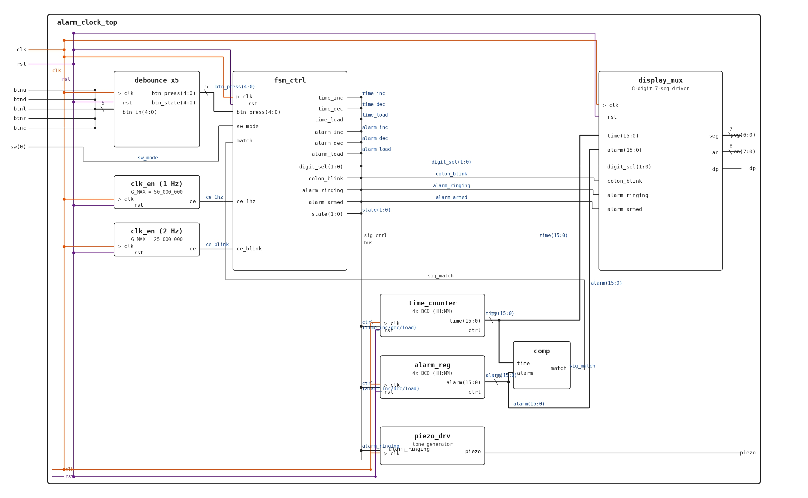

# Alarm Clock (VHDL Project)

Tento projekt implementuje digitální 24hodinový budík v jazyce **VHDL** pro vývojovou desku **Nexys A7-50T**. Systém umožňuje nastavení aktuálního času, konfiguraci budíku a zvukovou i vizuální signalizaci buzení.

**Autoři:** Barák, Glaser, Kapaňa

---

## Popis projektu
Cílem projektu je vytvořit plně funkční digitální hodiny s budíkem. 

### Zobrazení na displeji:
* **Levé 4 segmenty (HH:MM):** Aktuální běžící čas. Dvojtečka bliká s frekvencí **1 Hz** (1 Hz je 1 sec).
* **Pravé 4 segmenty (HH:MM):** Nastavený čas budíku. Dvojtečka svítí trvale (v režimu aktivního budíku).

---

## Ovládání a režimy

Projekt využívá přepínače a tlačítka na desce Nexys A7 k přepínání mezi různými stavy systému.

### 1. Nastavení času (SET_TIME)
* **Aktivace:** Přepnutím přepínače SW(0).
* **Ovládání:** * LEFT / RIGHT: Přepínání mezi jednotlivými ciframi (aktivní cifra bliká **2 Hz**).
    * UP / DOWN: Změna hodnoty vybrané cifry.
* **Uložení:** Vrácením SW(0) do výchozí polohy se čas spustí.

### 2. Nastavení budíku (SET_ALARM)
* **Aktivace:** Stiskem středového tlačítka BTNC v režimu běhu (RUN).
* **Ovládání:** Shodné s nastavením času (tlačítka UP/DOWN a LEFT/RIGHT).
* **Uložení:** Opětovným stiskem BTNC. Budík se tímto uloží a aktivuje (armed).

### 3. Režim Alarmu (ALARM_RING)
* **Aktivace:** Nastane při shodě aktuálního času s časem budíku.
* **Projevy:** * **Zvuk:** Piezo bzučák generuje varovný tón.
    * **Vizuál:** Pravé čtyři segmenty displeje včetně dvojtečky blikají.
* **Vypnutí:** Stiskem středového tlačítka BTNC. Po vypnutí pravá část displeje zhasne a budík čeká na nové nastavení.

---

## Technická architektura

Projekt se skládá z několika propojených modulů, které zajišťují stabilitu a logiku systému:

| Komponenta | Funkce |
| :--- | :--- |
| **Debounce moduly** | 5 jednotek pro eliminaci zákmitů mechanických tlačítek. |
| **Clock Enablers** | Generátory 1Hz a 2Hz pulzů pro časovou logiku a blikání. |
| **FSM Controller** | Konečný automat řídící stavy: RUN, SET_TIME, SET_ALARM, ALARM_RING. |
| **BCD Counter** | Čítač pro uchovávání a inkrementaci aktuálního času. |
| **Alarm Register** | Registr pro uložení nastaveného času budíku. |
| **Comparator** | Neustálé porovnávání času a budíku pro vyvolání alarmu. |
| **7-seg Display Driver** | Multiplexovaný ovladač pro zobrazení dat na 8 segmentech. |
| **Tone Generator** | Modul pro generování signálu pro piezo bzučák. |

---

##  Přílohy a soubory projektu

### Schéma a hardwarová omezení
* **Schéma zapojení:** 
* **Nexys A7-50T Constraints:** [alarm_clock_top.xdc](alarm_clock_top.xdc)
* **Project file:** [alarm_clock.xpr](alarm_clock_v1.xpr)

### Grafy simulací
* [Simulace CLK_EN](clk_en_simulation.png)
* [Simulace COMP](comp_simulation.png)
* [Simulace TIME_COUNTER](time_counter_simulation.png)
* [Simulace PIEZO_DRV](piezo_drv_simulation.png)
* [Simulace DEBOUNCE](debounce_simulation.png)
* [Simulace ALARM_REG](alarm_reg_simulation.png)
* [Simulace FSM_CTRL](fsm_ctrl_simulation.png)
* [Simulace DISPLAY_MUX](display_mux_simulation.png)

### Zdrojové kódy (VHDL)
* [Top Module](alarm_clock_top.vhd)
* [Alarm Register](alarm_reg.vhd)
* [Display Mux](display_mux.vhd)
* [FSM Control](fsm_ctrl.vhd)
* [Clock Enable](clk_en.vhd)
* [Comparator](comp.vhd)
* [Time Counter](time_counter.vhd)
* [Piezo Driver](piezo_drv.vhd)
* [Debounce](debounce.vhd)
