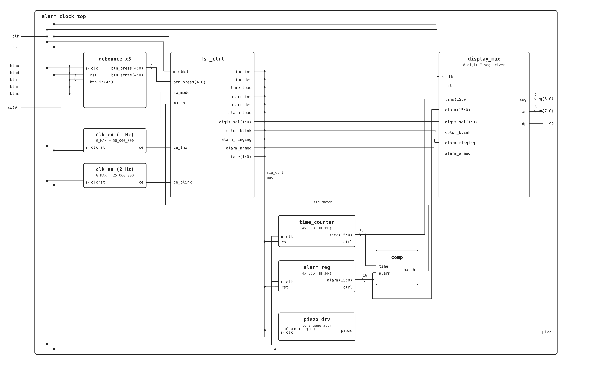

# VUT-DE1-AlarmClock
Barák, Glaser, Kapaňa Alarm clock VHDL project

Alarm Clock — popis projektu

Cílem projektu je návrh a implementace 24hodinového budíku na vývojové desce Nexys A7-50T v jazyce VHDL. Hodiny zobrazují aktuální čas na levých čtyřech segmentech 7segmentového displeje (formát HH:MM) a čas budíku na pravých čtyřech segmentech. Dvojtečka mezi hodinami a minutami na straně času bliká s frekvencí 1 Hz, zatímco na straně budíku svítí trvale.  
Nastavení času se aktivuje přepínačem SW(0) — po přepnutí do režimu SET_TIME uživatel pomocí tlačítek UP/DOWN mění hodnotu vybrané cifry a tlačítky LEFT/RIGHT přepíná mezi ciframi. Aktivně nastavovaná cifra bliká frekvencí přibližně 2 Hz. Přepnutím SW(0) zpět se hodiny vrátí do režimu RUN a čas běží. Nastavení budíku se aktivuje stiskem středového tlačítka (BTNC) z režimu RUN — ovládání je totožné s nastavením času. Potvrzením středovým tlačítkem se budík uloží a označí jako aktivní (armed).  
Při shodě aktuálního času s nastaveným časem budíku (match) a aktivním budíku se systém přepne do stavu ALARM_RING — piezo bzučák generuje tón a pravé čtyři segmenty včetně dvojtečky blikají. Budík se vypne stiskem středového tlačítka, pravá strana displeje zhasne a čeká na nové nastavení budíku.  
Projekt využívá tyto hlavní komponenty: pětici debounce modulů pro stabilizaci tlačítek, dva generátory hodinového signálu (clk_en) pro 1Hz a 2Hz pulzy, FSM řadič se čtyřmi stavy (RUN, SET_TIME, SET_ALARM, ALARM_RING), BCD čítač času, registr budíku, komparátor, multiplexovaný ovladač 8místného 7segmentového displeje a generátor tónu pro piezo.
## Alarm Clock Schematic

## Nexys A7 50T constraints file

[Open Constraints](alarm_clock_top.xdc)

## Simulation pics
[CLK_EN Simulation](clk_en_simulation.png)
[COMP Simulation](comp_simulation.png)

## VHDL Code Files
[CLK_EN VHDL file](clk_en.vhd)
[COMP VHDL file](comp.vhd)

